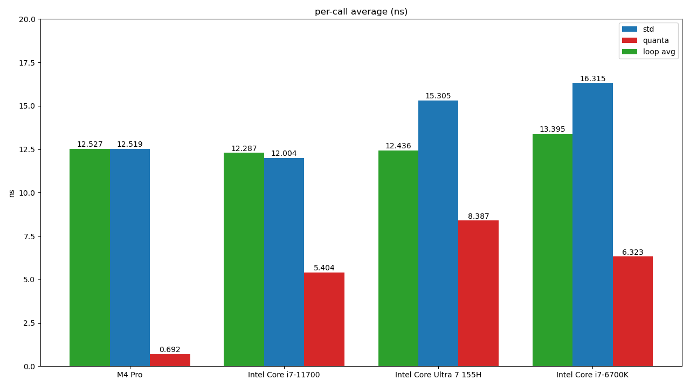

# 比較する

## きっかけ

- <https://qiita.com/moriai/items/2e39357fc34c54f6de49>

## std::timeとquanta::Clockの違い

- (あくまで参考程度に)
- <https://docs.rs/quanta/latest/quanta/> より
- std::timeはOSに対してsystem call
- quantaはCPUのレジスタを直接読み取ってるみたいな感じ？なので、OSを介さない分timeが返ってくるのが早くてその分のオーバーヘッド削減が見込めるってことであってる？
  - TSC(Time Stamp Counter)というのをみてるらしい
  - 古いCPUとかで無理そうなときはstd::timeを呼ぶらしい

## 比較

### 懸念と前提

- CPUの寿命が早まるとかあったらいやだなあ
- 多分電力とかで結果は多少揺れる
  - でも何が影響して結果変わるのかいまいちわからない
- コードは大体こんな感じ(clineちゃんありがとう)

```rust
let n: u32 = 1_000_000

// std::time::Instant::now() の実行時間計測
let t_start = Instant::now();
for _ in 0..n 
{
    black_box(Instant::now());
}
let t_total = t_start.elapsed();

// quanta::Clock::now() の実行時間計測
let clock = Clock::new()
let q_start = clock.now();
for _ in 0..n 
{
    black_box(clock.now());
}
let q_total = q_start.elapsed();
```

- また、for文自体の実行時間も以下のように計算し、上の二つから減じる

```rust
// ループ自体の実行時間計測
let loop_start = clock.now();
let dummy: u64 = 0;
for _ in 0..n 
{
    black_box(dummy);
}
let loop_total = loop_start.elapsed()
```

### 比較対象

- CPUで違いあったりするのかなと思っていろいろ用意しました

- intel Core Ultra 7 155H
  - 貸与ノートPC
- Intel Core i7-6700K
  - 貸与デスクトップ
- intel core i7 11700
  - 私物デスクトップ
- Apple M4 Pro
  - 私物ノートPC

### 比較結果

- 一応時間をおいて何回か計測しなおして、外れ値ではないことは確認
  - 一時点では1000000回の平均とってる



- for文自体の実行時間は差無し(緑)
- 全体的にstdよりquantaの方が高速(std:青, quanta:赤)
  - 調べた感じCPU自体のベンチマークは ultra-7 > i7-11700 > i7-6700K だった。この結果を見た感じ、CPUの性能自体は関係ないとは言わずとも他に大きな要因があるのか
    - ちなみにノートPCを節電モードとかにするとstdもquantaも増えます
  - M4 Proは異次元ですね

## まとめ

- std::timeよりquanta::Clockの方がオーバーヘッドが少なそう！
- でもこのオーバーヘッド削減がうれしい！ってなる場面ってどこなんだろう
