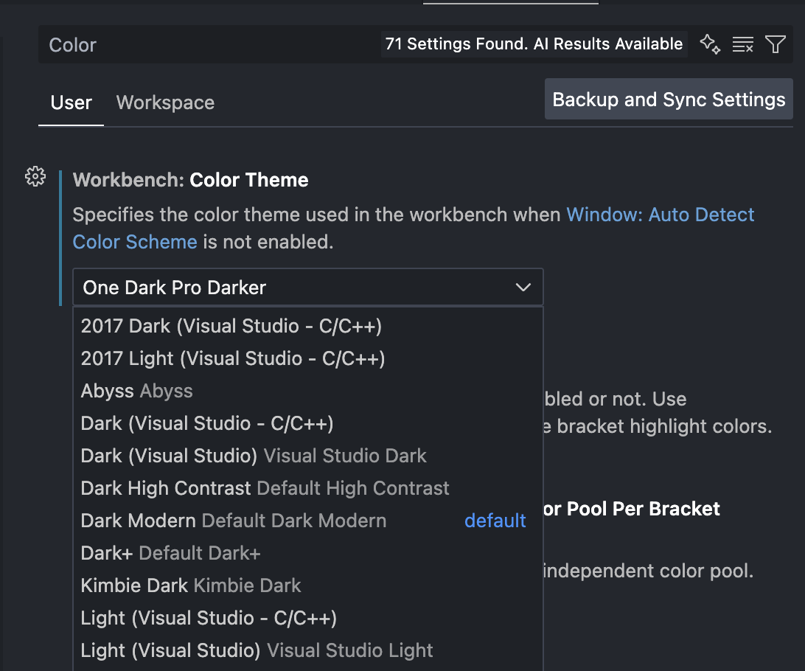
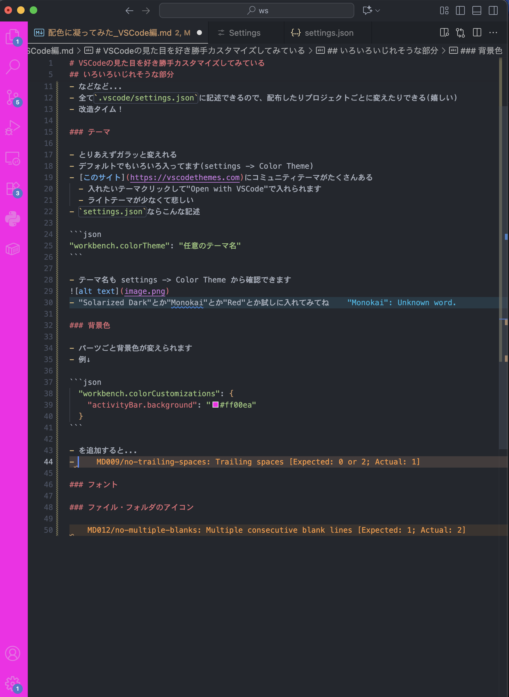

# VSCodeの見た目を好き勝手カスタマイズしてみている

- 毎日使うものだし、せっかくならみやすい&好みの感じにしたいよね
- みんなのカスタマイズを見てみたい(VSCode以外でも)

## いろいろいじれそうな部分

- 各パーツやテキストの背景色、透明度、境界線など
- フォント
- 文字色
- ファイル・フォルダのアイコン
- などなど...
  - いじろうと思えば無限にいじれる
- 全て`.vscode/settings.json`に記述できるので、配布したりプロジェクトごとに変えたりできる(嬉しい)
- 改造タイム！

### テーマ

- とりあえずガラッと変えれる
- デフォルトでもいろいろ入ってます(settings -> Color Theme)
- [このサイト](https://vscodethemes.com)にコミュニティテーマがたくさんある
  - 入れたいテーマクリックして"Open with VSCode"で入れられます
  - ライトテーマが少なくて悲しい
- `settings.json`ならこんな記述

```json
"workbench.colorTheme": "任意のテーマ名"
```

- テーマ名も settings -> Color Theme から確認できます

- "Solarized Dark"とか"Monokai"とか"Red"とか試しに入れてみてね
- 自分は[One Dark Pro](https://vscodethemes.com/e/zhuangtongfa.Material-theme/one-dark-pro)の"Darker"を設定しています↓

```json
"workbench.colorTheme": "One Dark Pro Darker",
```

### 各パーツやテキストの背景色、透明度、境界線など

- パーツごと背景色が変えられます
  - 要はテーマが一気に変える部分を自分でひとつひとつ変えれる感じです。なので大量の設定項目があります
  - 一覧 [https://code.visualstudio.com/api/references/theme-color]
  - oosugi
- 例↓

```json
  "workbench.colorCustomizations": {
    "activityBar.background": "#ff00ea"
  }
```

- を追加すると...
- 
  - ；；
- あんまりいじってないのですが、自分は今はこんな感じ↓

```json
"workbench.colorCustomizations": {
    "activityBar.background": "#5d5d5d00",
    "contrastActiveBorder": "#3e3e3e",
},
```

### フォント

- エディタ部分
- 
- UI部分
  - なんか見える部分の設定からは変えられなそう？
  - 下のサイトとかが参考になりそうだけど、めんどそうなので一旦パス

### ファイル・フォルダのアイコン

